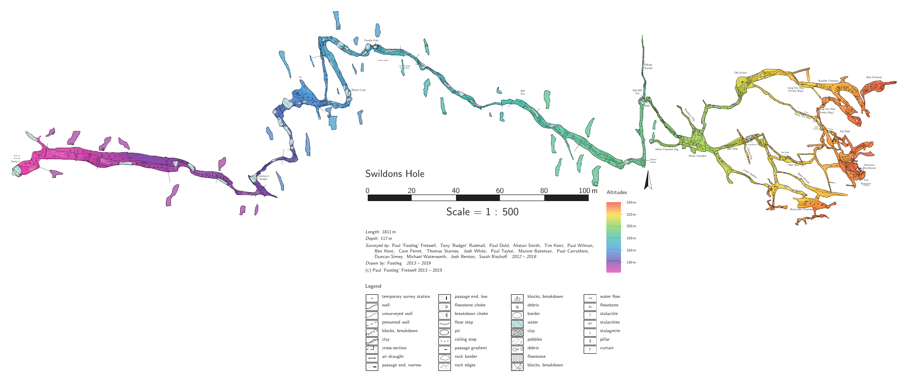
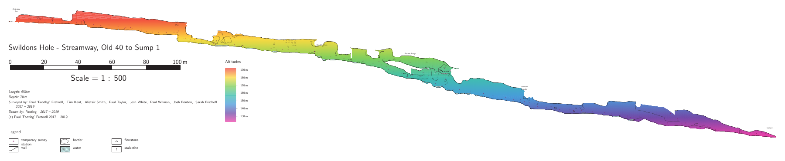

# Swildons Hole

[](https://paperclipmonkey.github.io/caves-mendip-swildons/)

## **[Open the survey →](https://paperclipmonkey.github.io/caves-mendip-swildons/)**

The survey of **Swildons Hole**, Priddy, Mendip, Somerset: the resurvey
led by Paul 'Footleg' Fretwell (2012–2019) joined to W. I. Stanton's
survey of the 1950s and 60s. The survey site has every sheet, the 3D
view, directions to the entrance and the route cards, rebuilt from this
repository every time it changes.

| On the survey site | |
|---|---|
| [Plan](https://paperclipmonkey.github.io/caves-mendip-swildons/Swildons-plan.pdf) | Entrance to Sump 1, coloured by altitude, with cross-sections along the streamway. 1:500. |
| [Extended elevation](https://paperclipmonkey.github.io/caves-mendip-swildons/Swildons-extended-elevation.pdf) | The whole drawn cave unrolled along its passages, entrance to Sump 1. 1:500. |
| [Streamway elevation](https://paperclipmonkey.github.io/caves-mendip-swildons/Swildons-streamway-elevation.pdf) | Extended elevation from the Old 40 to Sump 1, with Barnes Loop above the streamway. 1:500. |
| [Entrance Series plan](https://paperclipmonkey.github.io/caves-mendip-swildons/Swildons-entrance-plan.pdf) | The Entrance Series down to Rolling Thunder, with cross-sections. The entrances and Zig Zags, which lie on top of the passages below, are drawn 35 m to the east, joined to them by letters. 1:200. |
| [Entrance Series extended elevation](https://paperclipmonkey.github.io/caves-mendip-swildons/Swildons-entrance-extended-elevation.pdf) | The Entrance Series unrolled along its passages. 1:200. |
| [Entrance Series east–west elevation](https://paperclipmonkey.github.io/caves-mendip-swildons/Swildons-entrance-elevation.pdf) | Footleg's projected elevation, only partly drawn. 1:200. |
| [Plan, greyscale](https://paperclipmonkey.github.io/caves-mendip-swildons/Swildons-plan-bw.pdf) | For a black-and-white printer. |
| [Plan with centreline](https://paperclipmonkey.github.io/caves-mendip-swildons/Swildons-plan-centreline.pdf) | The plan with survey legs and station names, for resurveying. 1:500. |
| [Plan with Stanton's survey](https://paperclipmonkey.github.io/caves-mendip-swildons/Swildons-plan-with-stanton.pdf) | The plan plus Stanton's survey beyond it as centreline, with station names, for planning where to resurvey next. 1:500. |
| [The cave in 3D](https://paperclipmonkey.github.io/caves-mendip-swildons/3d/) | The survey beneath the Environment Agency's LIDAR ground surface and satellite imagery, in the browser. See [tools/model3d](tools/model3d/README.md). |
| [Getting there](https://paperclipmonkey.github.io/caves-mendip-swildons/surface/index.html) | For visitors new to the area: where to park and the walks to the entrance. See [tools/surface](tools/surface/README.md). |
| Route cards (draft) | One sheet per route through the cave, with the way to go at each junction, made from the survey. On the [survey site](https://paperclipmonkey.github.io/caves-mendip-swildons/); see [tools/routes](tools/routes/README.md). |

The survey site also has the 3D model (Survex `.3d` for Aven, Therion
`.lox` for Loch), Google Earth `.kml` files and the survey data as CSV
and SQL. The resurvey was done with DistoX and PocketTopo, and the
survey is drawn and built with [Therion](https://therion.speleo.sk/).

## What's surveyed

The centreline is about **4.2 km** of survey legs with **121 m** of
vertical range, fixed to the OS grid at the entrance by GPS.

- **The resurvey, about 1.8 km:** the Entrance Series, Rolling Thunder,
  and the streamway from the Old 40 down past the 20 ft Pot, Double
  Pots, Barnes Loop and Tratman's Temple to the free-dive bolt at
  Sump 1. All of it is drawn in plan and as an extended elevation
  (the streamway on its own sheet, the Entrance Series on another),
  with about 160 cross-sections: 39 along the streamway on the main
  plan, and the rest on the 1:200 Entrance Series plan. Footleg's
  projected east–west elevation of the Entrance Series is only partly
  drawn.
- **Stanton's survey, about 2.4 km:** everything beyond the resurvey,
  including St Paul's, Paradise Regained, the Maypole Series, Double
  Trouble and Swildons 2 (main streamway, Upper Mud Series, Black Hole
  Series, Vicarage Passage). It is centreline only, with no drawings.
  Where the resurvey has replaced one of his sections, his legs are kept
  to connect the rest of his survey but flagged `duplicate`, so they
  are not counted twice.

[](https://paperclipmonkey.github.io/caves-mendip-swildons/Swildons-streamway-elevation.pdf)

### Resurvey trips

| Date | Where | Team |
|---|---|---|
| 2012-09-09 | Zig Zags | Paul 'Footleg' Fretwell, Tony 'Badger' Radmall, Paul Wilman |
| 2013-02-23 | Long Dry Way (Pretty Way) | Footleg, Cave Ferret, Badger |
| 2013-02-24 | Short Dry Way, New Grottoes, Old Grotto to Water Chamber | Footleg, Paul Dold, Badger |
| 2013-06-29 | Water Rift to the Folded Strata corner; the Old 40 route | Badger, Paul Dold, Josh White; Ben Kent, Footleg |
| 2013-06-30 | Kenney's Dig to Showerbath; lower entrance area via Showerbath to Baptism | Badger, Paul Dold; Ben Kent, Footleg |
| 2016-01-16/17 | Wet Way oxbows; Butcombe oxbows | Footleg, Paul Dold, Ben Kent, Alistair Smith |
| 2016-07-09/10 | Water Chamber, Oxbow Junction, Wet Way keyhole, Lower Oxbow, inlet off Old Grotto | Footleg, Thomas Starnes, Paul Wilman |
| 2017-03-11 | Old 40 to the 20 ft Pot; Cistern Dig | Footleg, Josh White, Paul Wilman, Alistair Smith; Cave Ferret |
| 2017-03-25/26 | 20 ft Pot to Double Pots | Footleg, Michael Waterworth, Maxine Bateman, Duncan Simey, Paul Wilman, Paul Carruthers and Josh\* |
| 2017-07-08 | Double Pots through Barnes Loop | Footleg, Sarah Bischoff, Josh Benton |
| 2017-10-14 | Barnes Loop to Tratman's Temple | Footleg, Paul Taylor, Tim Kent |
| 2019-01-05 | Tratman's Temple to Sump 1; Rolling Thunder | Footleg, Tim Kent, Alistair Smith |

\* Josh's surname isn't recorded in the trip notes.

## How the drawings were made

Footleg drew the plan of the Entrance Series and the streamway down to
just below the 20 ft Pot himself, in xTherion. Everything else, the
plan from there to Sump 1 and all the extended elevations and
cross-sections, is converted from his PocketTopo sketches made
underground (the converter is in `tools/`):

- **Plan:** black lines are walls (brown for upper-level edges), smoothed,
  with retraced strokes dropped. Lines inside the passage become thin
  borders, as in his own drawings. Blue hatching becomes water, blue
  squiggles flow arrows, green marks flowstone, small loops boulders,
  and slope triangles gradient arrows. Passage names are placed from his
  station notes, and his handwritten notes become labels.
- **Floor detail:** floor steps, climbs (C1m to C2m) and gradients come
  from the floor line of his side-view sketches, checked against floor
  heights from the survey's downward splays. Floor sediment isn't
  recorded for this stretch, so none is drawn.
- **Elevation and cross-sections:** both come from the PocketTopo
  sketches, the elevations from the side views and the cross-sections
  from wherever Footleg drew them (the plan sketch on the 2013 trips,
  the side view later). Each leg's left/right direction from PocketTopo
  is copied into the survey files so Therion unrolls the cave the way
  he did. An unrolled elevation can't close a loop, so where Therion
  breaks one differently from a sketch the sketch is split, and
  passages can show a gap or an overlap there. Barnes Loop is drawn
  above the streamway as an oxbow. In the side views Footleg drew
  passages that overlap in other colours (the Wet Way in brown, the
  upper oxbows in grey), so those are walls too.
- **Which sketch:** the 2013 Entrance to Water Chamber side view comes
  from the original `.top` file, because the exported station list
  doesn't line up with its sketch. Wet Way Oxbows uses the January 2016
  sketch, which lines up better than the July 2016 one, except for the
  Wet Way Keyhole, which only the July sketch has. The 2017 Dry
  Way Stream sketch isn't used: its stations aren't in the Therion
  survey.

They are faithful to the sketches but not hand-finished. Each trip's
sketch is in its `pockettopo/` folder as an `.xvi` backdrop for anyone who wants
to refine the drawings in xTherion.

## Working on the survey

**[`tools/README.md`](tools/README.md) explains how to add a new SexyTopo
trip, drawings included.** `docs/ProjectWorkflow.txt` has the original
PocketTopo workflow.

The survey is filed by area, then by trip date:

```
entrance/                 the Entrance Series, down to the Old 40 and Rolling Thunder
  Swildons_MAP*.th        its maps: which drawings make up each sheet
  2013-06-30/             one folder per trip, named by its date
    Swildons_*.th         the trip's survey data and team, inputting its drawings
    Swil1P_*.th2          plan drawings
    Swil1E_*.th2          elevation drawings, which also hold the cross-sections
    pockettopo/           the original PocketTopo files and their exports
streamway/                the Old 40 to Sump 1, laid out the same way
stanton/                  W. I. Stanton's survey, one folder per trip (1951-62)
  Swildons_WIS*.th        joins his trips together
  logbooks/               scans and a transcription of his logbooks
```

A new trip goes in a new dated folder in its area (for example
`streamway/2026-11-07/`), with SexyTopo's files in a `sexytopo/`
folder inside it.

| Path | What it is |
|---|---|
| `Swildons_Centreline.th` | Inputs every trip and joins them together; the GPS fix. |
| `swildonsmaster.th` | The sheets: which maps make up each one. |
| `swildons.thconfig`, `swildons-entrance.thconfig`, `swildons-centreline.thconfig`, `swildons-stanton.thconfig` | Build configs. |
| `gb_layout.thc`, `altitude-colours.th` | Footleg's British symbol set and the altitude colours. |
| `therion.ini`, `fonts/` | Sets the maps in Source Sans 3 (SIL Open Font License, in `fonts/`). |
| `tools/` | The sketch converter and helpers for adding new trips: see [tools/README.md](tools/README.md). |
| `routes/`, `tools/routes/` | Route card definitions, and the tool that makes them. |
| `tools/model3d/`, `surface/lidar/` | The 3D view, and the LIDAR ground it uses (fetched once, kept here). |
| `legacy/` | The SVN project's own configs and its Survex export (`SwildonsHole.svx`). |

### Building it yourself

With Docker, using the same pinned Therion image as the website:

```bash
mkdir -p proj output
curl -fL -o proj/uk_os_OSTN15_NTv2_OSGBtoETRS.tif \
  https://cdn.proj.org/uk_os_OSTN15_NTv2_OSGBtoETRS.tif   # OS grid shift, for the KML
therion() { docker run --rm -v "$PWD:/project" \
  -e PROJ_DATA=/project/proj:/usr/share/proj -e PROJ_NETWORK=OFF \
  ghcr.io/paperclipmonkey/therion:6.4.0 "$@"; }
therion -l output/therion.log swildons.thconfig
therion -l output/therion-entrance.log swildons-entrance.thconfig
therion -l output/therion-centreline.log swildons-centreline.thconfig
therion -l output/therion-stanton.log swildons-stanton.thconfig
```

Or with Therion installed:
`therion -l output/therion.log swildons.thconfig`, `therion swildons-entrance.thconfig`,
`therion swildons-centreline.thconfig` and `therion swildons-stanton.thconfig`. The sheets land in `output/`.
Run them from the project root so Therion finds `therion.ini` and the
fonts; it also needs LCDF Typetools (`otftotfm`) installed, which the
Docker image has.

The website's plan is then enlarged to three times its page size, so a
phone will zoom far enough into it to read the labels (it is all vector,
so nothing is lost):
`python3 tools/enlarge_pdf.py output/Swildons-plan.pdf 3`. The older
`legacy/swildons_*.thconfig` files from the SVN project still work and
write into `legacy/`.

Every push to `main` rebuilds the survey and publishes it
(`.github/workflows/build.yml`). A pull request gets the built sheets
and survey statistics in a comment instead. Some things to know:

- Filenames are case-sensitive on the build machines, so an `input`
  must match the file's case exactly.
- `fix bottom` in `Swildons_Centreline.th` is a fake station that pins
  the bottom of the altitude colours. It is not a point in the cave.
- The Therion image is pinned to `6.4.0` so the survey renders the same
  until someone deliberately updates it.

## History

This repository was migrated from the `Swildons` folder of the
WookeyCatchment Subversion repository
(<https://www.cave-registry.org.uk/svn/WookeyCatchment/Swildons/>), with
its history from 2012 onwards. Each commit keeps its original author,
date and message, plus an `SVN-Revision:` line. Folders that are
access-restricted in SVN are not included.

## Licence

GPLv3. See `LICENSE`, which covers everything here unless a file or
folder says otherwise.
