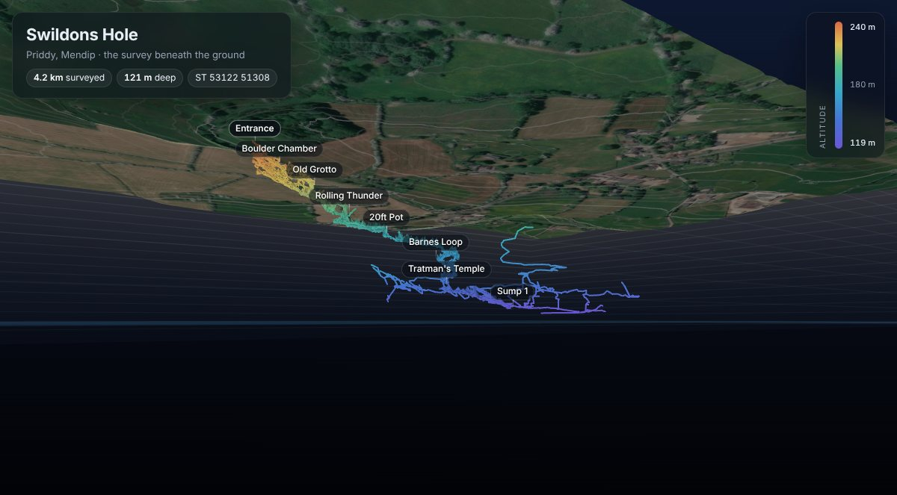

# The 3D view

The cave in 3D beneath the ground, in the browser: the survey under
the Environment Agency's LIDAR terrain, draped with satellite imagery.
It flies in from above to just below the ground, looking up at the
cave under it, and spins there until you take hold of it. It's in the spirit of the
[Qgis2threejs](https://github.com/minorua/Qgis2threejs) exports, but
made straight from the build, so it never goes out of date.

```bash
python3 -m tools.model3d      # after the main build; writes output/3d/
```



## What's in it

- **Passage walls** from `output/Swildons.lox`: the 3D passages Therion
  builds from the drawings and splays. Only the resurvey has walls.
- **The centreline** from `output/Swildons.3d`, Stanton's survey
  included. Splays can be turned on. Legs flagged `duplicate` (Stanton's
  legs that the resurvey has replaced) are left out.
- **Names** of passages and places, taken from the labels in the plan
  drawings (the same ones the route cards use, from `tools.routes.survey`),
  each at the height of the nearest station. The entrance is labelled
  just above the ground.
- **The ground**: the Environment Agency's 1 m LIDAR composite terrain
  model (DTM), averaged to 2 m, covering the cave plus 250 m around it.
  It's fetched once from their WCS service and kept in `surface/lidar/`,
  so builds don't fetch it again. If the cave grows past the edge, the
  next build fetches a bigger area: commit the new file.
- **Satellite imagery** from Esri World Imagery. The page loads it
  when it opens, so it isn't stored here.
- **The ground** is see-through (70% by default, with a slider), so
  from above the cave shows through it with depth as the view turns.
- **X-ray** (off by default): the ground fades wherever the cave is
  behind it, from whatever angle you look. The page draws the cave on its own into a
  small hidden image each frame, blurs it, and uses that to fade the ground.

Colours are altitude, warm near the surface and cold at depth, from the
highest station to the lowest. The vertical scale starts at 1.5&times;
and can be changed to 1&times; or 2.5&times;.

## Lining up the imagery

The survey is on the National Grid (OSGB36), the imagery on Web
Mercator (WGS84). The tool converts with the Ordnance Survey's
formulae and a Helmert shift, which is good to a few metres. Then it
moves everything by the gap between its own position for the entrance
and the one Therion writes to `output/Swildons-centreline.kml`, which
uses the exact OSTN15 grid. That leaves well under a metre of error
over the area. The page gets the result as an affine transform.

## Files

| File | What it is |
|---|---|
| `__main__.py` | Reads the build, fetches the LIDAR if needed, writes `output/3d/`. |
| `formats.py` | Readers for Survex `.3d` (v8), Therion `.lox` and uncompressed GeoTIFF. Plain Python. |
| `viewer.html` | The page: three.js from jsDelivr, no build step. It is copied to `output/3d/index.html` unchanged. |

The page loads `scene.json` (cave, names, stats, georeference) and
`terrain.bin` (heights in centimetres, 16-bit little-endian, row by
row from the north-west corner; 0 means no data). With `CHROMIUM` set,
as in CI, the tool also saves `preview.png` for the index page by
opening the page in headless Chrome with `?still`.

Credits shown on the page: the survey; Environment Agency LIDAR,
© Environment Agency copyright and/or database right, Open Government
Licence v3; imagery © Esri, Maxar, Earthstar Geographics and the GIS
User Community.
